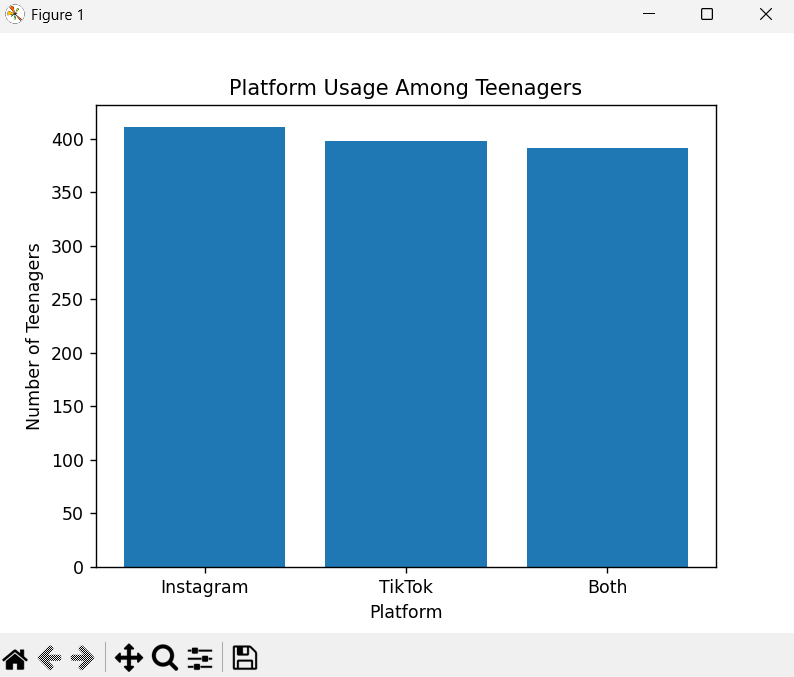
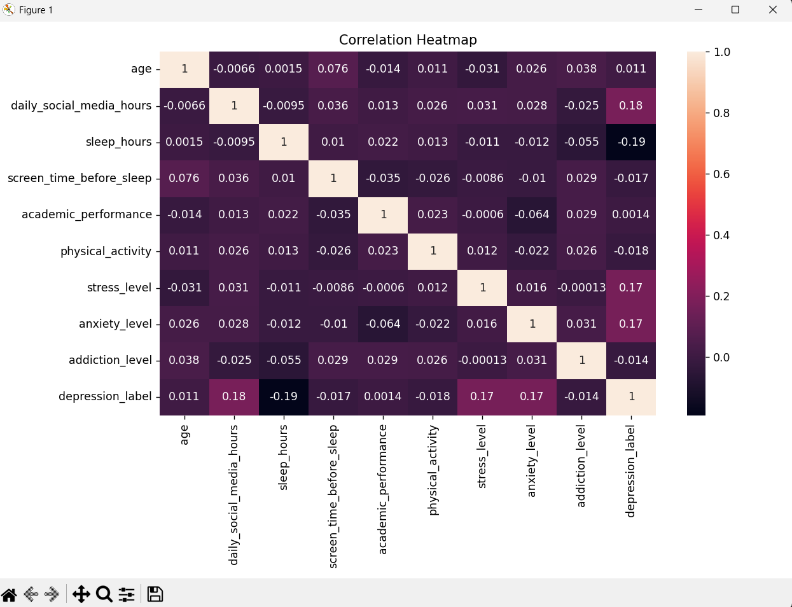
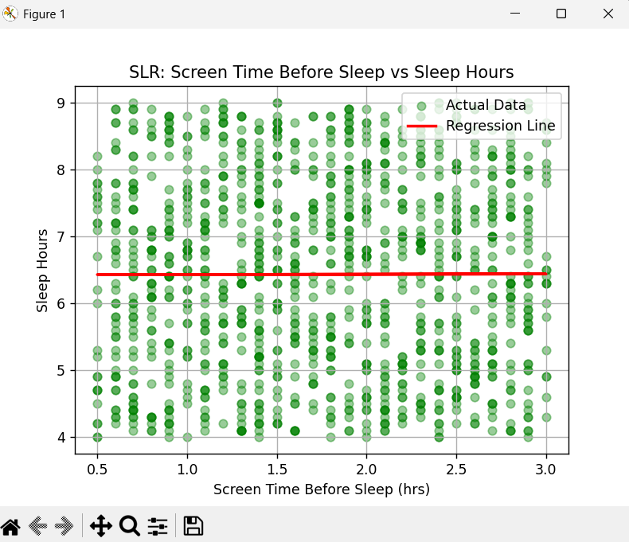
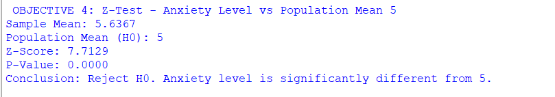
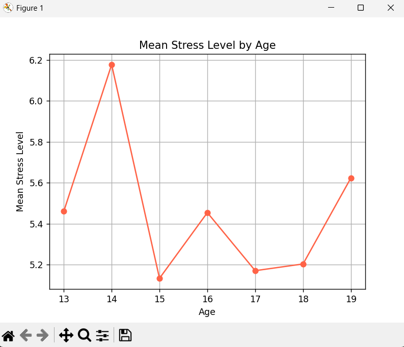

# Teen Mental Health Analysis
**Course:** INT375  
**Dataset:** Teen Mental Health Dataset (1200 records, 13 columns)  
**Data Source:** [Kaggle - Teenager Mental Health Dataset](https://www.kaggle.com/datasets/algozee/teenager-menthal-healy)

## Objectives
1. Platform Usage Distribution (Bar Chart)
2. Correlation Heatmap of mental health attributes
3. Simple Linear Regression – Screen Time vs Sleep Hours
4. Z-Test – Anxiety Level vs Population Mean
5. Mean Stress Level by Age (Line Plot)

## Libraries Used
- pandas, numpy, matplotlib, seaborn, scipy, sklearn

## How to Run
```bash
pip install pandas numpy matplotlib seaborn scipy scikit-learn
python Teen_Mental_Health_Project.py
```

## Key Findings
- Instagram is the most used platform (411 users)
- Z-Test confirms anxiety level significantly differs from mean of 5
- Screen time before sleep has minimal effect on sleep hours (R² ≈ 0)

## Results / Output Screenshots

### Objective 1 - Platform Usage (Bar Chart)


### Objective 2 - Correlation Heatmap


### Objective 3 - Linear Regression


### Objective 4 - Z-Test Output


### Objective 5 - Stress Level by Age

